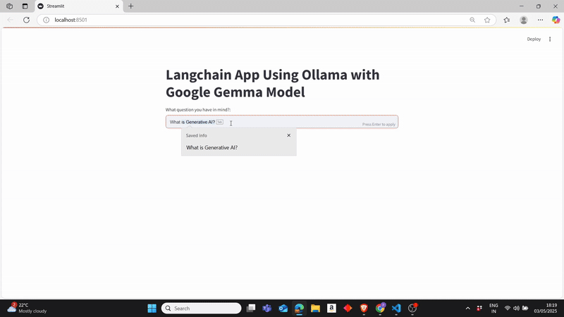

# 🌐 LangChain App with Ollama and Google Gemma Model

This is a simple Streamlit web application that leverages **LangChain**, **Ollama**, and **Google's Gemma 2B** model to create an interactive chatbot experience. The app uses a predefined system prompt and accepts user questions to generate insightful responses.

---
## 🎥 Demo




## 🚀 Features

- 🤖 Uses **Google Gemma 2B** model via **Ollama**
- 🔗 Built with **LangChain** for prompt handling and output parsing
- 🌱 Simple UI using **Streamlit**
- 🔍 Optional **LangSmith** integration for tracing and debugging

---

## 🛠️ Installation

1. **Clone the repository**

```bash
git clone https://github.com/yourusername/langchain-gemma-chatbot.git
cd langchain-gemma-chatbot
```

2. **Create and activate a virtual environment**

```bash
python -m venv venv
source venv/bin/activate  # On Windows use `venv\Scripts\activate`
```

3. **Install dependencies**

```bash
pip install -r requirements.txt
```

4. **Set up environment variables**

Create a `.env` file in the root directory and add:

```env
LANGCHAIN_API_KEY=your_langchain_api_key
LANGCHAIN_PROJECT=your_project_name
```

---

## 🧠 Model Info

This app uses the **`gemma:2b`** model from **Ollama**, integrated via `langchain_community.llms`.

Make sure Ollama is installed and running locally. You can install and run Gemma with:

```bash
ollama run gemma:2b
```

---

## ▶️ Usage

Run the Streamlit app:

```bash
streamlit run app.py
```

Enter a question in the text input box and get a response from the chatbot.

---

## 📦 Dependencies

- `streamlit`
- `langchain`
- `langchain_community`
- `python-dotenv`
- `ollama` (installed separately)

---

## 🧪 Optional: Enable LangSmith Tracing

To enable tracing via LangSmith, provide your credentials in the `.env` file as shown above. This enables monitoring and debugging for LangChain flows.

---

## 📄 License

MIT License
